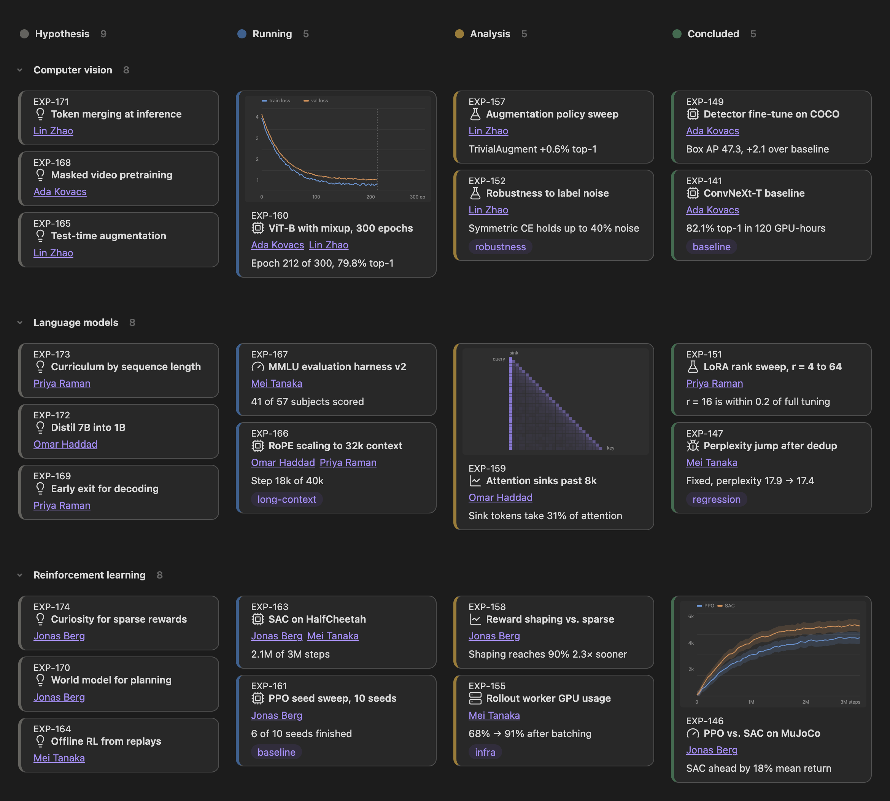
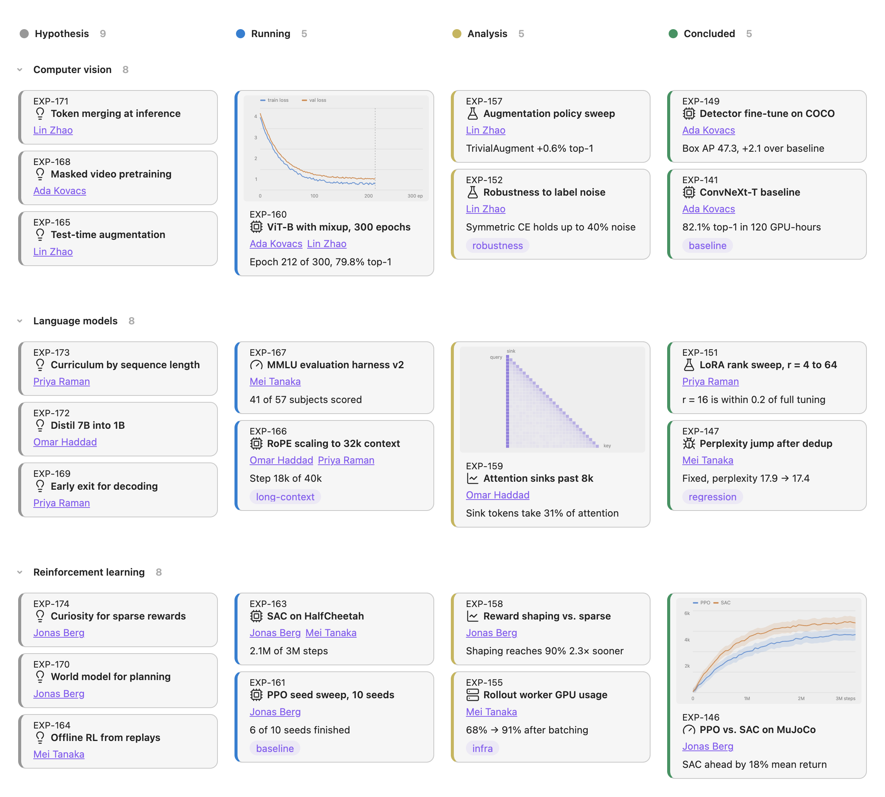

# Bases Board

[](https://obsidian.md/plugins?id=bases-board)
[](https://github.com/flowing-abyss/obsidian-bases-board/actions/workflows/release.yml)
[](https://github.com/flowing-abyss/obsidian-bases-board/releases)

<p align="center">
  
  
</p>

Bases Board adds a board view to Obsidian Bases. Your notes become cards laid out in
columns and rows, and moving a card updates the note's properties. Use it as a Kanban
board or as a gallery.

## Building a board

1. Open a base, add a view and choose **Board**.
2. Pick a **Group property** to sort notes into columns.
3. Add a **Sub-group property** if you want each column split into rows.

With only a sub-group property set, the cards form a gallery instead.

## Cards

You can edit properties right on the card, and links keep their Supercharged Links
styling.

- **Image property** adds a cover image or video from a URL, a link or a file in your
  vault.
- **Icon property** puts a [Lucide](https://lucide.dev/icons/) icon before the title.
- **ID property** shows an ID above the title that copies on click.
- **Hide empty properties** keeps cards short.
- **Card size** switches between small, medium and large cards.

**Icon mapping** picks an icon for each value of the icon property.

```
idea=lightbulb
training=cpu
bug=bug
```

To find icon names, run **Browse icons** from the command palette.

## Columns and rows

- Rename a column or row without changing the property value behind it.
- Reorder, hide and color them from the header menu.
- Choose whether colors apply to headers, cells or cards.
- Fold rows to hide their cards.
- Keep empty columns on the board by listing them in **Group order**.

## New notes

The **New note** button in each cell creates a note with that cell's column and row
values already set. Choose a **Folder** and a **Template** for new notes, including
Templater templates.

## Installation

Open Settings → Community plugins, browse for **Bases Board**, then install and enable it.
You can also install it straight from
[the plugin page](https://obsidian.md/plugins?id=bases-board). The plugin needs Obsidian
1.10.3 or later.

## Contributing

Issues and pull requests are welcome. Please read [Contributing](CONTRIBUTING.md) before
you start.

## License

[MIT](LICENSE)
